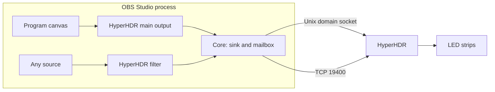
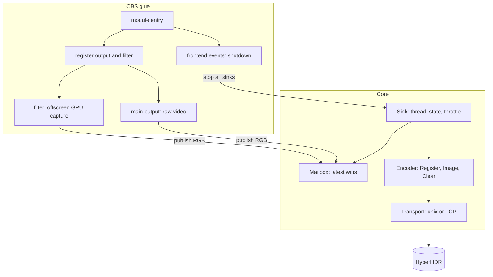
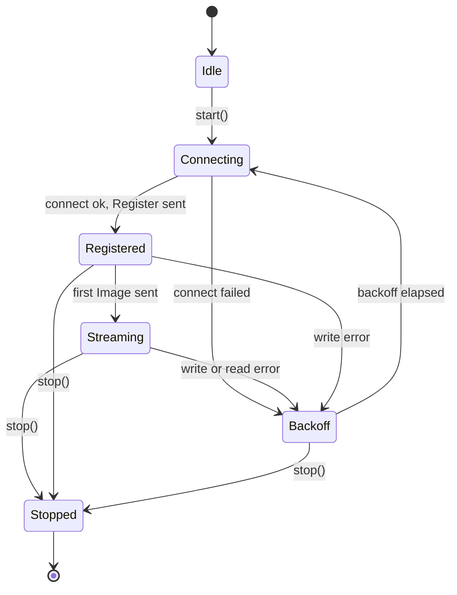
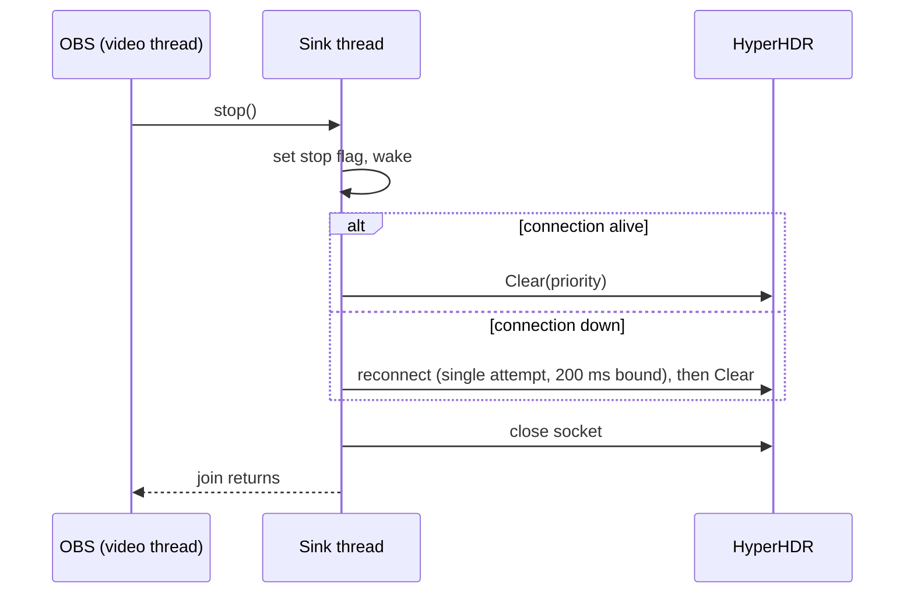

# Software Design Document

# obs-hyperhdr-flatbuffer: OBS to HyperHDR over FlatBuffers

| Field | Value |
|---|---|
| Status | Implemented through Phase 5 (core, main output, filter, settings UI). Phase 6 hardening and Phase 7 packaging in progress. See README for the verified scope. |
| Owner | Project owner (see Q-1 for license ownership) |
| Repository | `github.com/gllmAR/obs-hyperhdr-flatbuffer` |
| Targets | OBS Studio 32.2.2 (pinned in CI, obs-deps 2026-07-15). HyperHDR with the FlatBuffers server (TCP 19400 or domain socket). |
| Platforms | Linux x86_64, Windows x64, macOS arm64 |
| Plugin modes | Program main output (raw video) and per-source filter (GPU downscale) |
| License | GPL-2.0-or-later (decided, see Q-1) |
| Companion docs | [PLAN.md](PLAN.md), [research/01-hyperhdr-protocol.md](research/01-hyperhdr-protocol.md), [research/02-openframeworks-reference.md](research/02-openframeworks-reference.md), [research/03-obs-hive-reference.md](research/03-obs-hive-reference.md), [research/04-approach-evaluation.md](research/04-approach-evaluation.md), [research/05-build-ci-licensing.md](research/05-build-ci-licensing.md) |

---

## Table of Contents

1. [Introduction](#1-introduction)
2. [Scope](#2-scope)
3. [Requirements](#3-requirements)
4. [System context](#4-system-context)
5. [Architecture](#5-architecture)
6. [Core library](#6-core-library)
7. [Wire protocol](#7-wire-protocol)
8. [Sink lifecycle and threading](#8-sink-lifecycle-and-threading)
9. [Main output (program mix)](#9-main-output-program-mix)
10. [Filter (per source)](#10-filter-per-source)
11. [Configuration](#11-configuration)
12. [Shutdown and error handling](#12-shutdown-and-error-handling)
13. [Platform layer](#13-platform-layer)
14. [Repository layout and build](#14-repository-layout-and-build)
15. [CI](#15-ci)
16. [Test strategy](#16-test-strategy)
17. [Performance budget](#17-performance-budget)
18. [Risks](#18-risks)
19. [Design decisions](#19-design-decisions)
20. [Open questions](#20-open-questions)
21. [Glossary](#21-glossary)

---

## 1. Introduction

This project provides an OBS Studio plugin that sends video to a HyperHDR instance as small RGB images, using the HyperHDR FlatBuffers protocol. It offers the two integration patterns that OBS plugins commonly use:

- A **main output** that publishes the program canvas (like DistroAV's main output).
- A **filter** that publishes any single source (like DistroAV's dedicated output filter).

Both share one core library that implements the protocol, transport, and sender. The core has no OBS or Qt dependency so it can be tested without OBS.

The design draws on three references:

- [ofxhyperhdr](research/02-openframeworks-reference.md) for the proven wire path and sender design.
- [HIVE obs-hive](research/03-obs-hive-reference.md) for the OBS main-output and filter patterns, the shutdown ordering, and the render-state lessons.
- [HyperHDR protocol research](research/01-hyperhdr-protocol.md) for the schema and transport facts.

## 2. Scope

### 2.1 Goals

- **G-1** Drive HyperHDR LEDs from the OBS program canvas through a main output.
- **G-2** Drive HyperHDR LEDs from any single OBS source through a filter.
- **G-3** Run on Linux, Windows, and macOS from one code base.
- **G-4** Build the plugin for all three platforms in CI on every change, with tests that run without a HyperHDR instance.
- **G-5** Never leave a HyperHDR priority slot claimed after OBS stops or exits.
- **G-6** Never block the OBS render or video thread on network I/O.
- **G-7** Keep the core free of OBS and Qt, so it builds and tests standalone.

### 2.2 Non-goals (v1)

- NV12 image payloads (schema supports them, v1 does not use them).
- HyperHDR `Color` requests (single colour holds). The core may expose the encoder but the plugin does not use it in v1.
- HEVC or any video codec on the HyperHDR path. The target is a small RGB image.
- Audio.
- Configuring HyperHDR itself (priorities other than ours, colour mapping, LED layout).
- WAN or multi-site routing. Remote hosts are reachable through the TCP endpoint setting only.
- Windows named pipe transport (TCP only on Windows in v1).
- Signed and notarized macOS distribution (release concern, not v1).

## 3. Requirements

### 3.1 Functional

| ID | Requirement |
|---|---|
| FR-1 | The main output sends the program canvas as RGB frames at a configurable size (default 64x36) and rate (default 30 fps, maximum 60). |
| FR-2 | The filter sends the filtered source's output as RGB frames using the same size and rate settings. |
| FR-3 | Each active main output or filter instance owns one sink with its own origin and priority. |
| FR-4 | A sink sends `Register` after every connect, then `Image` frames, and `Clear` on stop. |
| FR-5 | A sink reconnects automatically after a transport failure, with backoff. |
| FR-6 | Endpoint selection: domain socket first (POSIX, when enabled and reachable), then TCP. |
| FR-7 | Settings are editable in OBS. The main output has a Tools dialog. The filter has its own properties page. |
| FR-8 | The plugin warns when two active sinks use the same priority. |
| FR-9 | The sink state (idle, connecting, registered, streaming, backoff) is visible to the user in the UI. |

### 3.2 Non-functional

| ID | Requirement | Target |
|---|---|---|
| NFR-1 | Render and video thread overhead per frame | Under 0.5 ms (excluding OBS's own work) for the filter, measured on Linux CI hardware |
| NFR-2 | Send path never blocks the producer | Producer call returns in bounded time regardless of socket state |
| NFR-3 | Clear on teardown | Sent on every stop, source switch, and exit path where the socket is reachable |
| NFR-4 | Frame size limit | Reject payloads over 10,000,000 bytes and zero-length frames |
| NFR-5 | Quit without deadlock | OBS exits within 5 s with Lua or Python scripts loaded |
| NFR-6 | Resource stability | No growth in memory or file descriptors over a 1 h soak test |

## 4. System context



HyperHDR is an external process. The plugin is the only client that claims the priority slot on behalf of OBS.

## 5. Architecture

### 5.1 Layers

| Layer | Responsibility | Depends on |
|---|---|---|
| Core (`src/core/`) | Protocol encoder, framing, transport, sink state machine, mailbox | Standard C++17 and platform sockets only |
| OBS glue (`src/obs/`) | Module entry, output and filter registration, frontend events, render and video callbacks | libobs, obs-frontend-api, core |
| UI (`src/ui/`) | Tools dialog for the main output (Qt, optional) | Qt6 Widgets, core settings |
| Tests (`tests/`) | Golden bytes, mock server, mailbox, sink state machine | Core, Python (test only) |

### 5.2 Component diagram



### 5.3 Module responsibilities

| Module | Responsibility |
|---|---|
| `Encoder` | Build `Request` FlatBuffers for `Register`, `Image` (RawImage RGB), `Clear`, and optionally `Color`. Frame with a 4-byte big-endian length. |
| `Transport` | Open a Unix domain socket or TCP connection, write all bytes, drain replies, close. Abstracts POSIX and Winsock. |
| `Mailbox` | Hold the most recent frame. Publisher never waits on the sender. |
| `Sink` | Own the thread, the state machine, the connection, the throttle, and the teardown `Clear`. |
| `Registry` (glue) | Track live sinks so shutdown can stop them all. |

## 6. Core library

### 6.1 Public types (sketch)

```cpp
namespace hhd {

struct Endpoint {
    bool        preferDomainSocket = true;   // POSIX only
    std::string domainSocketPath;            // empty = derive from TMPDIR, fallback /tmp
    std::string host = "127.0.0.1";
    uint16_t    port = 19400;
};

struct SinkConfig {
    std::string origin;                      // shown in HyperHDR priority list
    int         priority    = 150;           // 0..254, lower wins
    int         width       = 64;            // 8..256
    int         height      = 36;            // 8..256
    float       maxFps      = 30.0f;         // 0 = unthrottled, max 60
    bool        flipVertical = false;
    Endpoint    endpoint;
};

enum class SinkState { Idle, Connecting, Registered, Streaming, Backoff, Stopped };

class Mailbox {                              // latest wins, never blocks publisher
public:
    void publish(const uint8_t* rgb, size_t bytes);   // copy into back buffer, swap
    bool take(std::vector<uint8_t>& out);             // sender thread
};

class Sink {
public:
    explicit Sink(SinkConfig cfg);
    ~Sink();                                 // stop() if still running
    bool start();                            // spawns thread, returns immediately
    void submit(const uint8_t* rgb, size_t bytes);   // non-blocking
    void stop();                             // Clear (bounded), close, join
    SinkState state() const;
    std::string lastError() const;
};

}  // namespace hhd
```

### 6.2 Encoder

- Hand-rolled FlatBuffers writer, clean-room from the MIT schema, with vtable dedup (see [research/01](research/01-hyperhdr-protocol.md)).
- Functions: `encodeRegister(origin, priority)`, `encodeImageRgb(rgb, w, h, duration)`, `encodeClear(priority)`.
- Default `duration = -1` (no expiry), matching the schema default.
- Output is a complete frame: 4-byte big-endian length followed by the root.
- Invariant: payload length between 1 and 10,000,000 bytes. The encoder returns an error otherwise.

### 6.3 Transport

- POSIX: `AF_UNIX` `SOCK_STREAM` to the domain socket path, or `AF_INET` TCP to `host:port`. `TCP_NODELAY` on TCP. `SO_SNDTIMEO` = 1 s. Socket non-blocking after connect.
- Windows: Winsock TCP only. `WSAStartup` once per process.
- Domain socket path default: `$TMPDIR/hyperhdr-domain` (strip trailing `/`), falling back to `/tmp/hyperhdr-domain`. Matches the Qt `QLocalServer` temp-dir behaviour recorded in [research/01](research/01-hyperhdr-protocol.md).
- Write: all bytes or failure. Partial writes loop. `MSG_NOSIGNAL` on Linux, `SO_NOSIGPIPE` on macOS.
- Read: drain available reply bytes after each write and on idle ticks, so the socket cannot wedge.

## 7. Wire protocol

### 7.1 Schema (namespace `hyperhdrnet`)

```text
table Register  { origin:string (required); priority:int; }
table RawImage  { data:[ubyte]; width:int = -1; height:int = -1; }
table Image     { data:ImageType (required); duration:int = -1; }
table Clear     { priority:int; }
table Color     { data:int = -1; duration:int = -1; }
union Command   { Color, Image, Clear, Register }
table Request   { command:Command (required); }
```

### 7.2 Frame

```text
+--------------------+----------------------------------+
| u32 BE length N    | FlatBuffers Request (N bytes)     |
+--------------------+----------------------------------+
```

Constraints: `1 <= N <= 10,000,000`.

### 7.3 Messages used in v1

| Message | Sent when | Fields |
|---|---|---|
| `Register` | After every connect | origin, priority |
| `Image` (RawImage RGB) | Each frame that passes the throttle | width, height, RGB bytes (`3 * w * h`), duration -1 |
| `Clear` | On stop, on source switch, on exit | priority |

The writer uses slot numbers from [research/01](research/01-hyperhdr-protocol.md) (`4 + 2 * fieldIndex`).

## 8. Sink lifecycle and threading

### 8.1 State machine



Backoff: start at 250 ms, double each failure, cap at 2 s, reset on a successful Register.

### 8.2 Teardown sequence



Rule: `Clear` is sent before the socket closes, on every stop path. The stop call is bounded to about 500 ms so OBS shutdown cannot hang on a dead network.

### 8.3 Threads and ownership

| Thread | Work | Must not |
|---|---|---|
| OBS video thread (main output) | `raw_video` callback: copy frame into `Mailbox` | Wait on the sink, call socket APIs |
| OBS graphics thread (filter) | Offscreen render callback: GPU downscale, stage, map, copy into `Mailbox` | Start or stop pipelines, call encoders |
| OBS video tick (both) | Start and stop sinks, read settings, rebuild on size change | Be skipped for pipeline start or stop |
| Sink thread (one per sink) | Take frame, throttle, encode, write, drain replies, reconnect | Touch OBS APIs |
| Shutdown (frontend event) | Call `stop()` on all sinks in the registry | Hold locks needed by render callbacks |

Start and stop of sinks always run on the OBS video tick or the Qt main thread. This matches HIVE's lesson that starting an encoder from the graphics thread deadlocks.

### 8.4 Throttle

- The sink thread enforces `maxFps`. A frame arriving faster than the interval is dropped (the mailbox holds only the latest anyway).
- `maxFps = 0` disables the throttle.

## 9. Main output (program mix)

- Registered as `obs_output_info` with id `hyperhdr_output` and flags `OBS_OUTPUT_VIDEO` only (raw, no encoder).
- Start: from the Tools dialog or from the output's start on the video tick. `start` creates a `Sink` with the output's settings and calls `obs_output_set_video_conversion` to RGBA (or BGRA) at the configured size. The conversion is verified in the Phase 3 spike (see Q-5).
- `raw_video` callback: copies the frame to `Mailbox::publish`. Converts RGBA to RGB24 in the sink thread, so the callback stays cheap.
- Stop: `obs_output_stop` calls `Sink::stop`, which sends `Clear`.
- Settings: enabled flag, origin, priority, width, height, max FPS, flip vertical, plus the global endpoint. Stored as described in section 11.

Option for later (not v1): replace the CPU conversion with a GPU downscale path identical to the filter, if the Phase 3 measurement shows the CPU path is too costly.

## 10. Filter (per source)

Registered as `obs_source_info` with id `hyperhdr_filter`, type `OBS_SOURCE_TYPE_FILTER`, flags `OBS_SOURCE_VIDEO`. Follows the HIVE pattern, with a 64x36 GPU capture instead of an encoder.

### 10.1 Behaviour

| Callback | Action |
|---|---|
| `create` | Parse settings, register in the instance registry, `obs_add_main_render_callback(offscreen, self)`. |
| `video_tick` | Read source size. If not started or size changed, stop and start the sink and resources. Start runs here, not on render. |
| `video_render` | `obs_source_skip_video_filter(self)`. Pass-through: the filter does not change the picture. |
| offscreen callback | If not shutting down and not re-entered and started: `gs_texrender_begin` at the configured size, `gs_ortho` with the parent size (GPU downscale), `gs_clear`, `obs_source_skip_video_filter(self)`, `gs_texrender_end`, `gs_stage_texture` into a stage surface at the configured size, map, copy to `Mailbox`. |
| `destroy` | Remove from registry, remove the render callback, stop the sink, free resources. |
| `update` | Apply settings and rebuild on the next tick. |

### 10.2 Rendering rules (from HIVE)

- Use `obs_source_skip_video_filter`, not `obs_source_default_render`. The default render does not draw async sources such as cameras and media.
- Push and pop all render state inside the capture (`gs_blend_state_push` and pop, sRGB and linear state saved and restored), so one instance cannot poison another or the main scene.
- Keep a per-instance `in_capture` re-entry guard and a per-frame `rendered` flag.
- Use per-instance names for any OBS-allocated objects (keyed by the filter pointer).

### 10.3 Size

- Capture size is the configured size (default 64x36), independent of the source size. The GPU does the resample.
- Aspect: the filter stretches the source to the configured size by default. An option `keep_aspect` (default off) letterboxes instead. Decision recorded as D-10.

## 11. Configuration

### 11.1 Global (endpoint)

Stored in the module config path (`obs_module_config_path`) as `hyperhdr.json`:

```json
{
  "version": 1,
  "endpoint": {
    "prefer_domain_socket": true,
    "domain_socket_path": "",
    "host": "127.0.0.1",
    "port": 19400
  },
  "main_output": {
    "enabled": false,
    "origin": "OBS Program",
    "priority": 150,
    "width": 64,
    "height": 36,
    "max_fps": 30,
    "flip_vertical": false
  }
}
```

### 11.2 Per filter instance (OBS source data)

| Key | Type | Default | Range or notes |
|---|---|---|---|
| `origin` | string | empty (use source name) | Max 64 bytes |
| `priority` | int | 150 | 0 to 254 |
| `width` | int | 64 | 8 to 256 |
| `height` | int | 36 | 8 to 256 |
| `max_fps` | float | 30 | 0 to 60 |
| `flip_vertical` | bool | false | |
| `keep_aspect` | bool | false | See D-10 |

### 11.3 Validation

- Out-of-range values are clamped and logged. The UI shows the clamped value.
- Duplicate priority across active sinks: log a warning and show it in the UI (FR-8). Both sinks still run.
- Empty origin: fall back to the source name (filter) or `OBS Program` (main output).

## 12. Shutdown and error handling

### 12.1 Shutdown

- A registry tracks every live sink.
- On `OBS_FRONTEND_EVENT_SCRIPTING_SHUTDOWN` and `OBS_FRONTEND_EVENT_EXIT`, the plugin:
  1. Sets a global shutting-down flag. Render callbacks return immediately when it is set.
  2. Removes every offscreen render callback.
  3. Stops every sink (sends `Clear`, bounded to about 500 ms per sink).
- This ordering prevents the scripting-mutex deadlock recorded in HIVE.

### 12.2 Errors

| Condition | Behaviour |
|---|---|
| No endpoint reachable | Sink stays in `Backoff`, UI shows last error, OBS keeps running |
| Write error mid-stream | Sink closes, enters `Backoff`, re-registers on reconnect |
| Frame too large or zero-length | Encoder error, frame dropped, logged once per second |
| Socket write timeout (1 s) | Treated as a write error |
| OBS graphics failure during capture | Capture skipped for that frame, logged once |
| Settings change | Sink stopped (sends `Clear` if the origin or priority changed) and restarted |

Logging uses OBS `blog` with a `[hyperhdr]` prefix. No exception crosses the C boundary.

## 13. Platform layer

| Concern | POSIX (Linux, macOS) | Windows |
|---|---|---|
| Socket type | `AF_UNIX` and `AF_INET` | `AF_INET` only (v1) |
| Init | none | `WSAStartup` once |
| Close | `close` | `closesocket` |
| SIGPIPE | `MSG_NOSIGNAL` (Linux), `SO_NOSIGPIPE` (macOS) | not applicable |
| Domain path | `$TMPDIR` or `/tmp` | not applicable |
| Error text | `strerror(errno)` | `WSAGetLastError` formatted |

The shim follows the pattern of HIVE's [hive_net.h](../inspiration/HIVE/plugins/obs-hive/src/net/hive_net.h): a small wrapper with no buffering and no threads.

## 14. Repository layout and build

### 14.1 Layout

```text
CMakeLists.txt
src/
  core/        encoder, transport, mailbox, sink (no OBS, no Qt)
  obs/         module entry, main output, filter, registry, shutdown
  ui/          Tools dialog (Qt6, optional)
  platform/    socket shim (posix, win)
data/
  locale/en-US.ini
tests/
  golden/      byte-exact encoder tests and fixtures
  mock/        mock HyperHDR server (Python)
  unit/        mailbox, sink state, throttle, framing limits
tools/
  verify_flat.py
  mock_hyperhdr.py
docs/          this folder
.github/workflows/ci.yml
```

### 14.2 Build

| Option | Default | Effect |
|---|---|---|
| `HYPERHDR_BUILD_OBS` | ON | Build the OBS plugin (requires libobs) |
| `HYPERHDR_QT_UI` | ON | Build the Tools dialog (requires Qt6 Widgets) |
| `HYPERHDR_BUILD_TESTS` | ON | Build core tests |

Dependencies: CMake 3.24 or later, C++17, libobs and obs-frontend-api (OBS 32.2.2, pinned in CI), Qt6 Widgets (optional). Python 3 with `flatbuffers` for golden tests only.

The core target (`hhd_core`) builds with `HYPERHDR_BUILD_OBS=OFF` and `HYPERHDR_QT_UI=OFF`, which is the default for the core-test CI job.

## 15. CI

GitHub Actions workflow `.github/workflows/ci.yml`, on push and pull request.

| Job | Runner | Gate | Content |
|---|---|---|---|
| `core` | ubuntu-24.04 | Required | Build core, golden byte tests, mock-server tests, mailbox tests, ThreadSanitizer run |
| `obs-build` | matrix: ubuntu-24.04, windows-2022, macos-14 | Required | Restore cache, build libobs (pinned), build plugin, check exported `obs_module_load`, upload artifact |
| `package` | tags only | Required for release | Zip or tar per OS, SHA-256 sums, GitHub release |

Caching keys: OS, OBS tag, obs-deps date. The libobs build is the slow step and must be cached.

Manual or self-hosted jobs (not in the gate): live HyperHDR smoke, plugin load in a running OBS, scripts-quit deadlock check.

Details and rationale: [research/05-build-ci-licensing.md](research/05-build-ci-licensing.md).

## 16. Test strategy

| Level | Test | Tooling | Where |
|---|---|---|---|
| Golden bytes | Encoder output equals the Python `flatbuffers` builder for fixed inputs | `tools/verify_flat.py`, C++ test | CI `core` |
| Framing | Length prefix, size limits (0 and 10,000,000+1 rejected) | C++ unit test | CI `core` |
| Mailbox | Latest-wins under concurrent publish and take | C++ test, TSan | CI `core` |
| Sink protocol | `Register` precedes `Image`, `Clear` before close on stop, re-`Register` after reconnect | Mock server (`tools/mock_hyperhdr.py`) | CI `core` |
| Reply drain | Mock server sends replies, sink must not stall | Mock server | CI `core` |
| Endpoint | Domain socket path from `TMPDIR`, TCP fallback | C++ test | CI `core` |
| Plugin load | Module exports `obs_module_load`, registers output and filter | Symbol check | CI `obs-build` |
| Live smoke | Priority active in HyperHDR `serverinfo`, LEDs follow the test pattern, `Clear` releases | `live_smoke` equivalent | Manual, self-hosted |
| Soak | 1 h streaming, memory and FD stable, reconnect when HyperHDR restarts | Script | Manual |
| Quit | OBS exits in under 5 s with Lua scripts loaded | Manual checklist | Manual |
| Filter regression | Three filters on three sources, including a camera and a media source, all publish | Manual checklist | Manual |

## 17. Performance budget

| Metric | Budget | Measured in |
|---|---|---|
| Filter render callback | under 0.5 ms per frame at 1080p source | Phase 4 |
| Main output callback | under 0.5 ms per frame (copy only) | Phase 3 |
| Sink CPU (64x36 at 30 fps) | under 2 % of one core | Phase 6 |
| Payload per frame | 6,912 bytes plus header | Fixed by design |
| End-to-end latency (source to LED) | under 100 ms on a LAN-local HyperHDR | Phase 6, manual |

## 18. Risks

| ID | Risk | Likelihood | Impact | Mitigation |
|---|---|---|---|---|
| R-1 | Domain socket unreachable (PrivateTmp, Flatpak, TMPDIR mismatch) | Medium | Low | TCP fallback; document the check (research/01) |
| R-2 | Windows HyperHDR transport is not TCP-reachable or differs | Medium | Medium | Spike in Phase 1; TCP-only is the stated v1 scope |
| R-3 | Filter render state poisons the scene (black renders) | Medium | High | HIVE rules (section 10.2); symmetric push and pop; regression checklist |
| R-4 | Quit deadlock with scripts | Medium | High | Shutdown ordering (section 12.1); quit test |
| R-5 | libobs CI build time and size | High | Medium | Caching; pinned versions |
| R-6 | Multiple sinks on one priority behave unpredictably in HyperHDR | Medium | Medium | Warning in UI (FR-8); test on hardware |
| R-7 | License conflict with ofxhyperhdr AGPL code | Low | High | Reuse only owner-authored files; clean-room the rest (Q-1) |
| R-8 | CPU conversion for the main output is too costly | Low | Medium | Measure in Phase 3; GPU path is the fallback |
| R-9 | macOS plugin distribution needs signing | High for release | Medium | Out of v1 scope; plan in Phase 7 |

## 19. Design decisions

| ID | Decision | Rationale | Alternatives rejected |
|---|---|---|---|
| D-1 | Two modes: main output and filter, one core | Covers DistroAV-style use cases | Main output only (no per-source); filter only (no program mix) |
| D-2 | RGB24 `RawImage` at 64x36 default | Tiny payload, proven in references | NV12 (not needed at this size); HEVC (adds codec and latency) |
| D-3 | Main output is raw (no encoder) | No codec needed; lowest latency | HIVE-style encoded output |
| D-4 | Filter downscales on the GPU into a 64x36 target | Minimal readback | Full-resolution CPU readback |
| D-5 | C++17 core with no OBS or Qt dependency | Standalone tests, easier threading | C11 core (harder mailbox and tests) |
| D-6 | Hand-rolled FlatBuffers writer | No Apache-2.0 runtime in a GPL-2.0 plugin; proven design | Official FlatBuffers runtime |
| D-7 | Qt dialog for main output, optional build | Matches OBS conventions; keeps Qt out of core CI | obs_properties only; JSON only |
| D-8 | GitHub Actions matrix for CI | Repo is on GitHub; native runners on all OS | Woodpecker (HIVE) |
| D-9 | Windows transport is TCP only in v1 | Only verified path in references | Named pipe (unverified) |
| D-10 | Filter stretches to the configured size by default; `keep_aspect` optional | Predictable LED mapping for the common case | Always letterbox (surprising for users who expect a straight stretch) |
| D-11 | One sink per main output and per filter instance | Matches HyperHDR's per-origin priority model | Shared connection (multiplexing unverified) |
| D-12 | Start and stop on the video tick, never on the graphics thread | Avoids the encoder and graphics deadlock recorded in HIVE | Start on render |

## 20. Open questions

| ID | Question | Owner | Needed by |
|---|---|---|---|
| Q-1 | **Resolved.** License: GPL-2.0-or-later, decided by the owner (Guillaume Arseneault). Reuse scope from `git blame` on `inspiration/ofxhyperhdr`: `ofxHyperHDRConnection.*` and `ofxHyperHDRFlat.*` are entirely owner-authored and may be relicensed. `ofxHyperHDR.cpp/.h` contains lines by cyberdelia, cyberpi-a, and cyberpi-b; do not reuse those files. Write the rest from the MIT HyperHDR schema (clean room). | Owner | Done |
| Q-2 | **Resolved.** OBS version pin: 32.2.2 (latest stable), obs-deps 2026-07-15 from the `CMakePresets.json` vendor block. Linux libobs built from source and the plugin loads against it. | Owner | Done |
| Q-3 | Windows HyperHDR transport: is there a named pipe, or is TCP the only option? | Owner, spike | Phase 1 |
| Q-4 | Two sinks at the same priority: how does HyperHDR merge or pick? | Spike on hardware | Phase 1 |
| Q-5 | `obs_output_set_video_conversion` availability and cost on each OS for the raw main output | Spike | Phase 3 |
| Q-6 | Non-Qt Tools menu entry (`obs_frontend_add_tools_menu_item`) in the pinned `obs-frontend-api.h` | Spike | Phase 5 |
| Q-7 | Default image size: 64x36 is the reference choice. Measure against real LED layouts. | Owner, hardware | Phase 6 |
| Q-8 | Flatpak or sandboxed OBS: can it reach the HyperHDR socket? If not, TCP is the documented route. | Spike | Phase 6 |

## 21. Glossary

| Term | Meaning |
|---|---|
| HyperHDR | Ambient lighting software that drives LED strips from a video image |
| Origin | Name a client registers with HyperHDR, shown in its priority list |
| Priority | Slot number. Lower wins. External sources use 150 by convention. |
| Clear | Request that releases a priority slot |
| Sink | One outgoing HyperHDR connection owned by one plugin instance |
| Mailbox | Latest-wins single-frame hand-off from the OBS thread to the sink thread |
| Main output | OBS output that publishes the program canvas |
| Filter | OBS source filter that publishes the filtered source |
