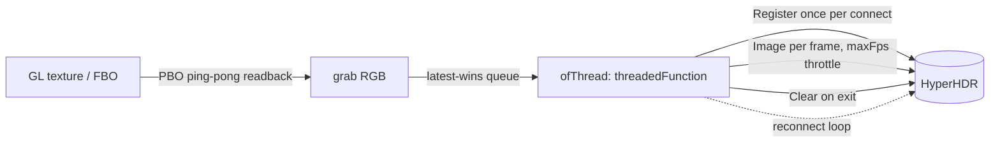

# Research 02: openFrameworks reference (ofxhyperhdr)

Status: research complete. Source: [inspiration/ofxhyperhdr](../../inspiration/ofxhyperhdr/README.md). This repo is a working reference, not a dependency.

## 1. What it is

An openFrameworks addon that streams frames from a GL texture or FBO to HyperHDR. It is a complete, tested sender with a proven wire path.

| File | Role |
|---|---|
| [ofxHyperHDRFlat.h](../../inspiration/ofxhyperhdr/src/ofxHyperHDRFlat.h), [.cpp](../../inspiration/ofxhyperhdr/src/ofxHyperHDRFlat.cpp) | Hand-rolled FlatBuffers writer (no `flatbuffers` runtime) |
| [ofxHyperHDRConnection.h](../../inspiration/ofxhyperhdr/src/ofxHyperHDRConnection.h), [.cpp](../../inspiration/ofxhyperhdr/src/ofxHyperHDRConnection.cpp) | Socket open (unix or TCP), `writeAll`, `drain`, `close` |
| [ofxHyperHDR.h](../../inspiration/ofxhyperhdr/src/ofxHyperHDR.h), [.cpp](../../inspiration/ofxhyperhdr/src/ofxHyperHDR.cpp) | `ofThread` sender, settings, PBO readback, latest-wins queue |
| `tests/` | `verify_flat.py`, `test_flat.cpp`, `live_smoke.cpp`, `frame_dump.cpp`, `Makefile` |

The addon is AGPL-3.0-or-later. The header attributes it to Guillaume Arseneault.

## 2. Architecture as built

The render thread enqueues a frame. The worker thread owns the socket, reconnects on failure, registers, drains replies, and clears on exit.

## 3. What to keep

- The wire encoder design: a small builder with vtable dedup, verified byte-exact against the Python builder. Reimplementing it cleanly is cheaper than adding a dependency.
- `Connection` behaviour: `TCP_NODELAY`, a 1 s send timeout, drain after write, explicit `close`.
- Latest-wins outbox. A slow network must never block the producer.
- Reconnect loop with `Register` on each connect.
- `Clear` on exit, and clear on settings change that alters the origin or priority.
- PBO ping-pong readback to avoid a GPU stall on the render thread.

## 4. What to change

| Issue | Change in the new design |
|---|---|
| openFrameworks dependency | Core must have no OBS or OF dependency and build standalone |
| Hardcoded `/tmp` socket | Derive from `TMPDIR` with `/tmp` fallback |
| Windows unsupported | Winsock shim; TCP-only on Windows in v1 |
| `static bool firstFrame` | Per-sink state |
| `maxFps` 60 vs 30 | One documented default (30), cap 60 |
| Single instance assumed | Each OBS output or filter owns one sink |
| AGPL-3.0 | Decision required (see [05-build-ci-licensing.md](05-build-ci-licensing.md)) |

## 5. Lessons recorded

1. Clear on every teardown path. HyperHDR keeps the slot after disconnect.
2. Drain replies. Without it the socket stalls.
3. Never block the producer. Use a latest-wins slot and throttle in the sender.
4. Keep the byte-exact tests. They caught encoder mistakes early and should be part of CI.
5. The live smoke test should confirm priority through the JSON API (`serverinfo`), then clear it. Skip cleanly when HyperHDR is absent.

## 6. Reusable test assets

- `tests/verify_flat.py`: golden byte comparison against the Python `flatbuffers` package. Port this into CI as a test (the Python package is a test-only dependency).
- `tests/live_smoke.cpp`: manual or self-hosted live check.
- `tests/frame_dump.cpp`: useful for diagnosing framing issues.
